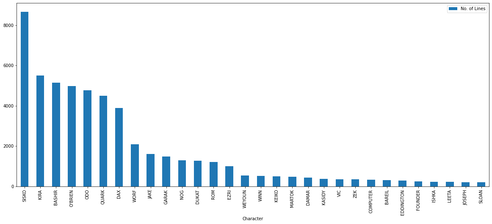

# NLP-Star-Trek-Scripts
Using digital form of the actual scripts of the 'Star Trek' science fiction series to perform interesting NLP tasks and answering some questions on Topic Modelling, Character properties and the plot as a whole.


## About the Dataset

The Dataset used can be found [here](https://www.kaggle.com/datasets/gjbroughton/start-trek-scripts?select=all_series_lines.json) on the Kaggle datasets. It consists of .json files with the full scripts of all Star Trek series processed into character lines:

Structure:

```json
allserieslines = { 
                  seriesname : 
                    {episode number : 
                        {character : alllines
                        }
                    }
                  }
```
e.g.
allserieslines['DS9']['episode 0']['SISKO']

Text scraped from [http://www.chakoteya.net/StarTrek/index.html](http://www.chakoteya.net/StarTrek/index.html)


### We choose a single series, DS9 i.e. Deep Space 9 for further investigation

A little bit of preliminary observation and browsing shows that 'DS9' has the least number of typos and missing space errors, making it a good quality dataset for our purposes.


## Answering some questions from the given Dataset using Natural Language Proccessing and Machine Learning techniques

### Question 1. Who has the most lines? Who are the top 5?

So, to count the no. of lines for each character, we simply count the number of entries of each character across all episodes.


