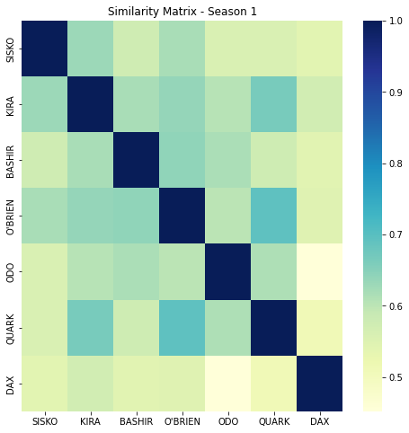

# NLP-Star-Trek-Scripts
Using digital form of the actual scripts of the 'Star Trek' science fiction series to perform interesting NLP tasks and answering some questions on Topic Modelling, Character properties and the plot as a whole.


## About the Dataset

The Dataset used can be found [here](https://www.kaggle.com/datasets/gjbroughton/start-trek-scripts?select=all_series_lines.json) on the Kaggle datasets. It consists of .json files with the full scripts of all Star Trek series processed into character lines:

Structure:

```json
allserieslines = { 
                  seriesname : 
                    {episode number : 
                        {character : alllines
                        }
                    }
                  }
```
e.g.
allserieslines['DS9']['episode 0']['SISKO']

Text scraped from [http://www.chakoteya.net/StarTrek/index.html](http://www.chakoteya.net/StarTrek/index.html)


### We choose a single series, DS9 i.e. Deep Space 9 for further investigation

A little bit of preliminary observation and browsing shows that 'DS9' has the least number of typos and missing space errors, making it a good quality dataset for our purposes.


## Answering some questions from the given Dataset using Natural Language Proccessing and Machine Learning techniques

## Question 1. Who has the most lines? Who are the top 5?

So, to count the no. of lines for each character, we simply count the number of entries of each character across all episodes. If we arrange them in descending order of the number of lines, and plot a bar graph, we get: 


### Hence, we see that the top 5 characters with the most lines are :
1. SSKO
2. KIRA
3. BASHIR
4. O'BRIEN
5. ODO


## Question 2. Who is the most verbose?
This basically means we are interested in the character who utters the most number of words. So we count the no. of words of each character.

Again, plotting a bar graph of each character and the number of words uttered in the whole series in descending order, we obtain:


### Hence, SISKO is the most verbose character


## Question 3. What are the main topics each main character talks about? Define how you determined main character.

#### If we notice the bar plots above, we notice that there is a sharp fall in number of lines/words for characters beyond **'DAX'**
Hence, we assume there are **7 Main Characters** :
1. SSKO
2. KIRA
3. BASHIR
4. O'BRIEN
5. ODO
6. QUARK
7. DAX

### Now, we use **Latent Dirichlet Allocation (LDA)** for Topic Modelling of the dialogues of the main characters in the Series in an unsupervised setup.

### About LDA

**LDA** is used to classify text in a document to a particular topic, primarily useful in an **unsupervised setting** such as this. It builds a topic per document model and words per topic model, modeled as Dirichlet distributions.

- Each document is modeled as a multinomial distribution of topics and each topic is modeled as a multinomial distribution of words.
- LDA assumes that the every chunk of text we feed into it will contain words that are somehow related. Therefore choosing the right corpus of data is crucial.
- It also assumes documents are produced from a mixture of topics. Those topics then generate words based on their probability distribution.

More info about LDA in the [original paper](http://www.jmlr.org/papers/volume3/blei03a/blei03a.pdf)

#### **Note:** We are assuming that there are at most 10 most frequent topics that the series is built around.

#### On training a multicore LDA model on our corpus with Bag-of-Words embedded text data, we obtained the 10 following topics in the Script:

- Topic 0: **Actions**
- Topic 1: **Spaceship Commands**
- Topic 2: **Spaceship**
- Topic 3: **Extraterrestrial Life**
- Topic 4: **Information**
- Topic 5: **Intellect**
- Topic 6: **Leadership**
- Topic 7: **Emotions**
- Topic 8: **Feelings**
- Topic 9: **Time and Events**

### Finally, we test the dialogues of each main character to find out the **TOP 2** topics they talk about throughout the series.

## Conclusions

### Based on the obtained results we see that the Main Characters talk about the following in the series:

| Character  | Top 2 Topics |
| ---------- | ----------- |
| SISKO      | Spaceship, Time and Events |
| KIRA       | Extraterrestrial Life, Time and Events |
| BASHIR     | Intellect, Time and Events |
| O'BRIEN    | Time and Events, Actions |
| ODO        | Intellect, Spaceship |
| QUARK      | Emotions, Extraterrestrial Life |
| DAX        | Time and Events, Actions |


## Question 4. How do the topics change throughout the series?

### Conclusions

#### Based on the results as depicted on the [iPython Notebook](Star_Trek_Script.ipynb), here are the top 2 topics each of the main characters talks about with changing seasons in the series:

#### Season 1 

| Character  | Top 2 Topics |
| ---------- | ----------- |
| SISKO      | Intellect, Time and Events |
| KIRA       | Time and Events, Spaceship |
| BASHIR     | Time and Events, Actions |
| O'BRIEN    | Time and Events, Spaceship Commands |
| ODO        | Time and Events, Intellect |
| QUARK      | Extraterrestrial Life, Spaceship Commands |
| DAX        | Time and Events, Actions |


#### Season 2 

| Character  | Top 2 Topics |
| ---------- | ----------- |
| SISKO      | Time and Events, Spaceship |
| KIRA       | Time and Events, Actions |
| BASHIR     | Intellect, Spaceship Commands |
| O'BRIEN    | Time and Events, Actions |
| ODO        | Time and Events, Intellect |
| QUARK      | Extraterrestrial Life, Emotions |
| DAX        | Time and Events, Spaceship |


#### Season 3 

| Character  | Top 2 Topics |
| ---------- | ----------- |
| SISKO      | Spaceship, Time and Events |
| KIRA       | Time and Events, Extraterrestrial Life |
| BASHIR     | Intellect, Actions |
| O'BRIEN    | Time and Events, Actions |
| ODO        | Spaceship, Intellect |
| QUARK      | Emotions, Extraterrestrial Life |
| DAX        | Time and Events, Actions |


#### Season 4

| Character  | Top 2 Topics |
| ---------- | ----------- |
| SISKO      | Spaceship, Time and Events |
| KIRA       | Time and Events, Extraterrestrial Life |
| BASHIR     | Feelings, Time and Events |
| O'BRIEN    | Time and Events, Intellect |
| ODO        | Spaceship, Feelings |
| QUARK      | Emotions, Intellect |
| DAX        | Time and Events, Feelings |


#### Season 5

| Character  | Top 2 Topics |
| ---------- | ----------- |
| SISKO      | Spaceship, Time and Events |
| KIRA       | Extraterrestrial Life, Spaceship |
| BASHIR     | Intellect, Time and Events |
| O'BRIEN    | Time and Events, Spaceship |
| ODO        | Time and Events, Intellect |
| QUARK      | Emotions, Information |
| DAX        | Spaceship, Time and Events |


#### Season 6

| Character  | Top 2 Topics |
| ---------- | ----------- |
| SISKO      | Extraterrestrial Life, Spaceship |
| KIRA       | Feelings, Extraterrestrial Life |
| BASHIR     | Leadership, Time and Events |
| O'BRIEN    | Time and Events, Intellect |
| ODO        | Intellect, Feelings |
| QUARK      | Emotions, Information |
| DAX        | Feelings, Leadership |


#### Season 7

| Character  | Top 2 Topics |
| ---------- | ----------- |
| SISKO      | Feelings, Spaceship |
| KIRA       | Leadership, Extraterrestrial Life |
| BASHIR     | Intellect, Leadership |
| O'BRIEN    | Time and Events, Actions |
| ODO        | Intellect, Spaceship |
| QUARK      | Emotions, Feelings |
| DAX        | Actions, Spaceship Commands |


## Question 5. Do one more thing with the data that is interesting to you!

### Let us investigate the simialrities between the **Main Characters** in the series based on their dialogues and how these similarities **change over seasons**. A close observation of the results would reveal the influence the characters have on each over time in the Star Trek universe, which in my opinion, is a very interesting insight. 

#### We have used the [Sentence BERT](https://www.sbert.net/) (Pre-trained Transformer Network - RoBERTa Large) model to encode sentences into 1024-dimensional embedded vectors.

### Plotting Season-wise Similarity Matrices between the Main Characters

#### Season 1



#### Season 2


#### Season 3


#### Season 4


#### Season 5


#### Season 6


#### Season 7


### Conclusions

#### As we can observe from the heatmap of the similarity matrices for the main characters, the similarities are lower in the first season, signifying that the characters are new and unbiased and not influenced by the others. But with increasing seasons, we notice a gradual shift towards **higher similarities** between the characters, with Season 4 and Season 5 showing significantly higher average similarities. This indicates that the characters themselves begins to influence the scriptwriting as the show progresses. 

#### This is an interesting observation.

#### Lastly, the last season, i.e. **Season 7** shows an abnormally high degree of similarity between the characters, except DAX. This could be due to the following reasons:
- Since we do not have the episode scripts from the last 3 episodes, our embeddings of the dialogues are not as accurate.
- Less participation of the main characters during the last season, i.e. some dying off, eliminated, outcast etc. 
- The entirety of Season 7 focusing on a limited set of plot concepts, causing heavy similarities between the dialogues of the main characters. 
